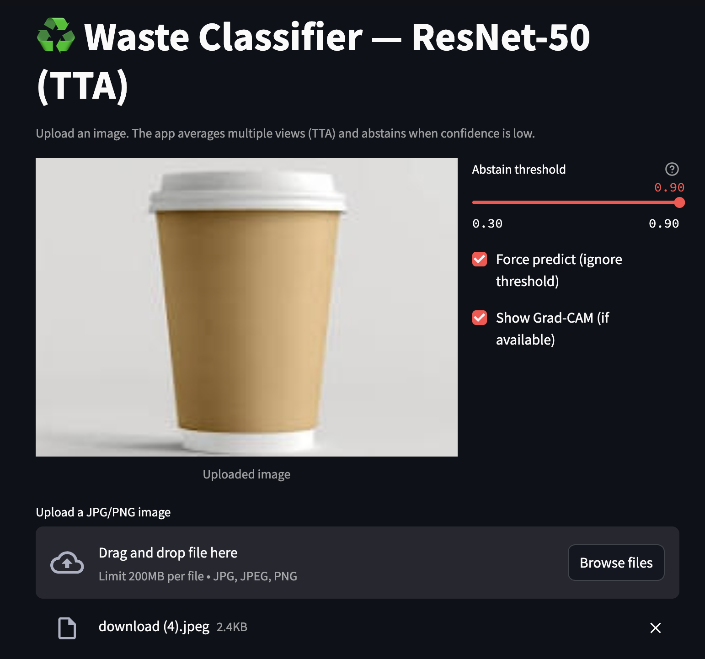
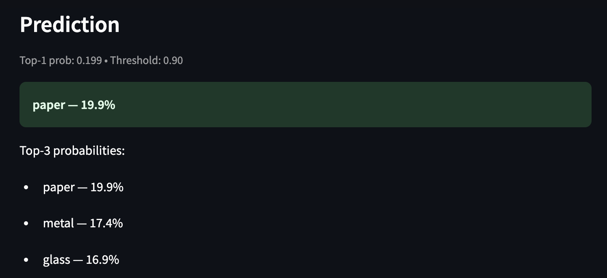
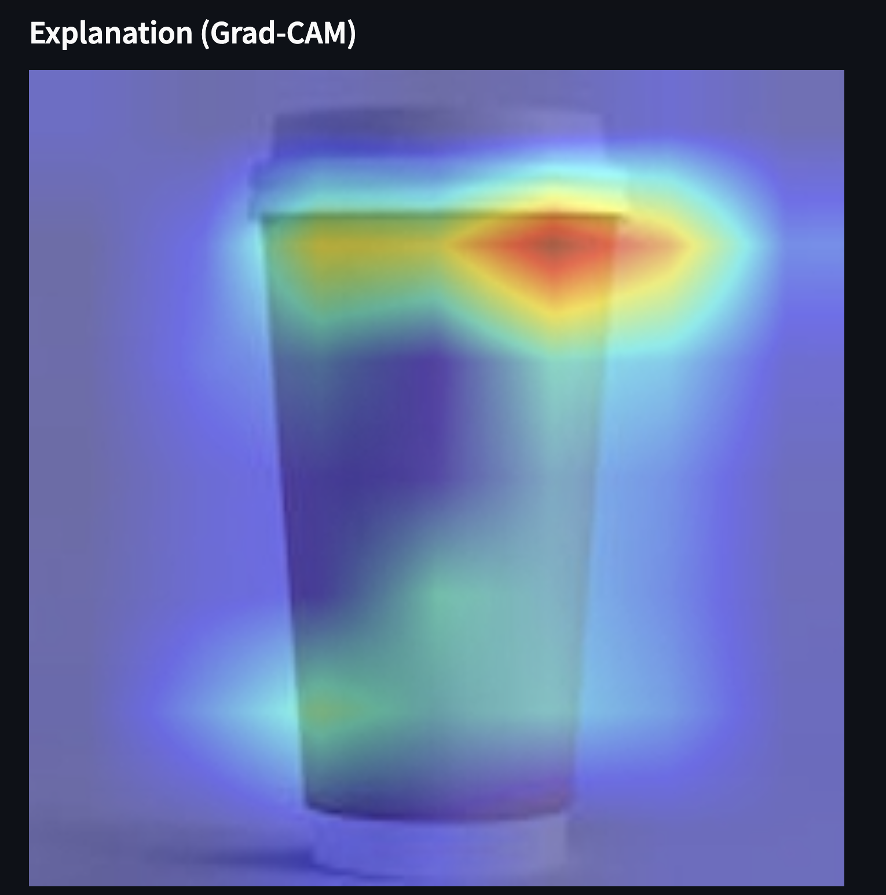
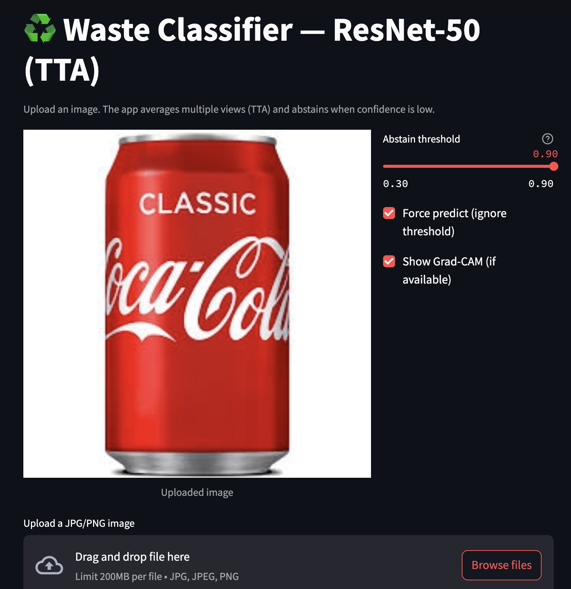
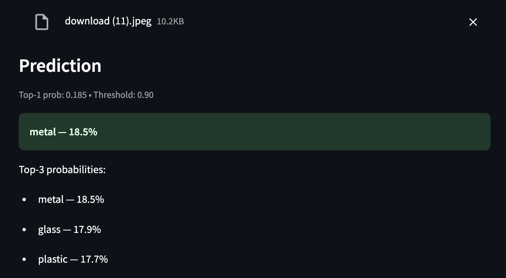
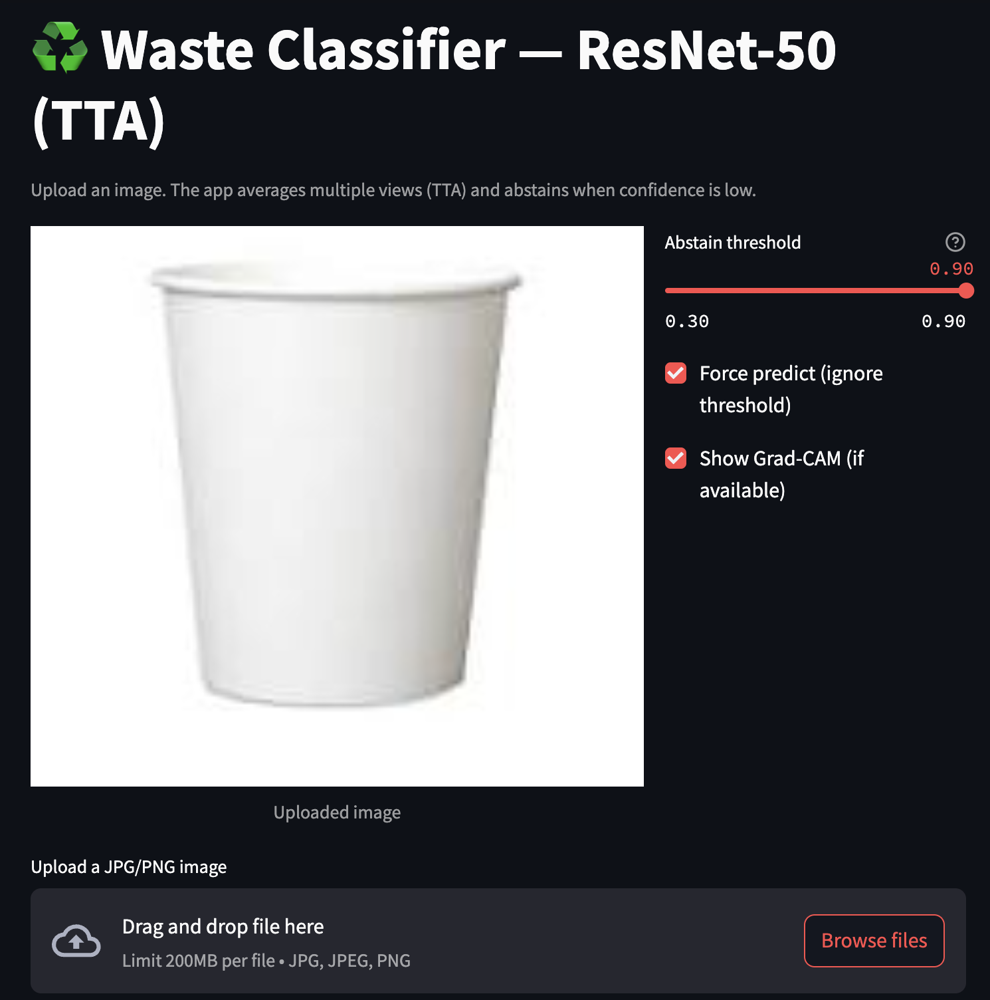
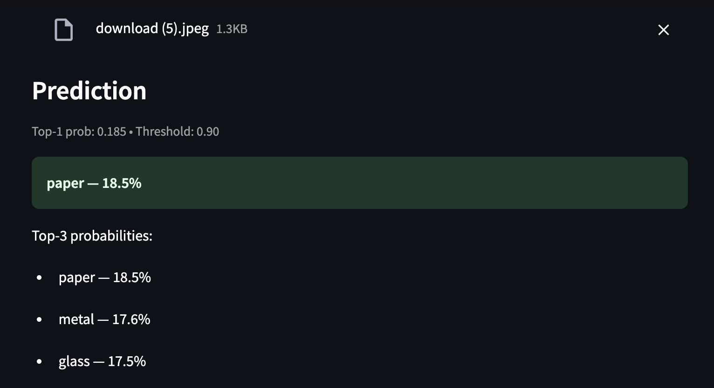
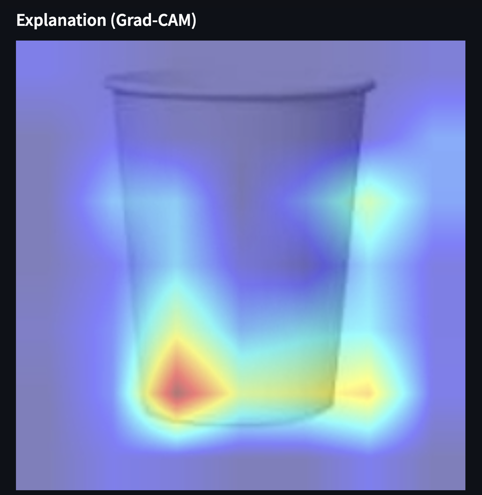

# ♻️ Waste Classifier - Deep Learning with ResNet-50 + Grad-CAM  

A deep learning project to classify household waste into **cardboard, glass, metal, paper, plastic, and trash**.  
Built using **PyTorch**, **timm models**, and a custom **Streamlit dashboard** with Grad-CAM explanations.  

---

## 🚀 Project Overview  
- Trained a **ResNet-50** model on a **large, diverse dataset** (≈4k+ cleaned & deduplicated images).  
- Improved with **data augmentation**, **fine-tuning**, and **test-time augmentation (TTA)**.  
- Integrated **Grad-CAM** visualizations to explain what the model "sees".  
- Built an **interactive Streamlit dashboard** to upload waste images and get predictions.  

---

## 📂 Repository Structure  

- `app.py` → Streamlit app (dashboard)  
- `download_model.py` → Helper to fetch trained model weights  
- `requirements.txt` → Python dependencies  
- `assets/` → Demo screenshots & Grad-CAM visualizations  
- `.gitignore` → Ignore large data/model files  

---

## ⚙️ Setup & Installation  

1. Clone this repo:  
   git clone https://github.com/shauryadata/waste-classifier.git
   cd waste-classifier  

2. Install dependencies:  
   pip install -r requirements.txt  

3. Download model weights:  
   python download_model.py  

4. Run the Streamlit app:  
   streamlit run app.py

## 🌟 Features  
✔️ 6-class waste classification  
✔️ Grad-CAM interpretability  
✔️ Test-Time Augmentation (TTA)  
✔️ Streamlit Dashboard with adjustable confidence threshold  
✔️ Easy deployment-ready structure  

## 🖼️ Sample Results  

Below are **3 sample predictions** from the Streamlit dashboard with Grad-CAM explanations.

| Example | Prediction Screenshot |  
|---------|------------------------|  
| Paper Cup |  |  
| Paper Cup (variation) |  |  
| Paper Cup (white) |  |  
| Metal Can |  |  
| Metal Can (variation) |  |  
| Metal Can (studio) |  |  
| Glass Bottle |  |  
| Glass Bottle (variation) |  |  
| Glass Bottle (studio) |  |  

## 🔮 Possible Improvements
- Train longer on a larger dataset (10k+ images)
- Experiment with ConvNeXt / ViT models
- Add real-time webcam classification
- Deploy on HuggingFace Spaces or Streamlit Cloud

## 📜 License

MIT License © 2025 Shauryaditya Singh
